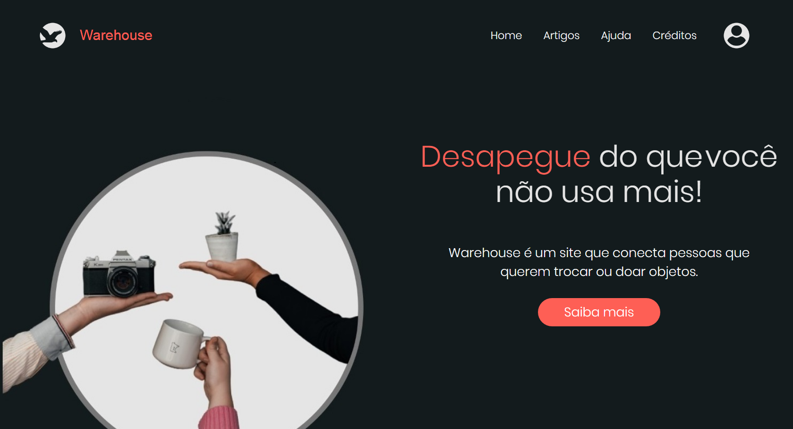
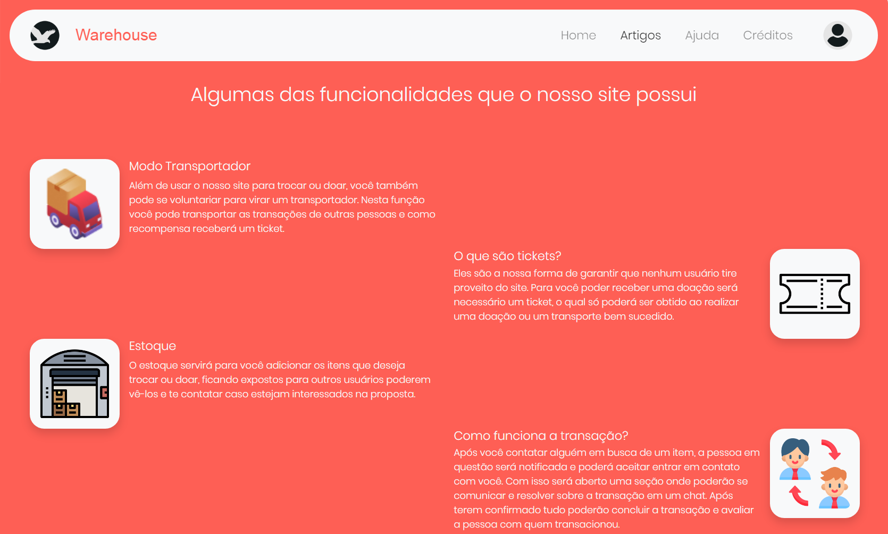
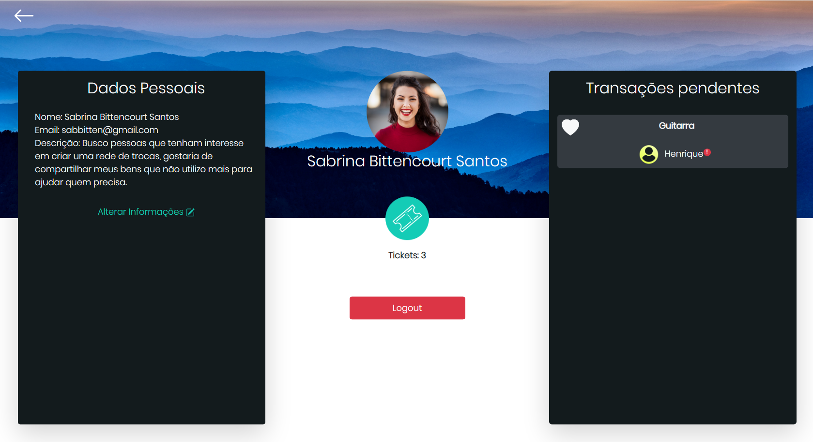
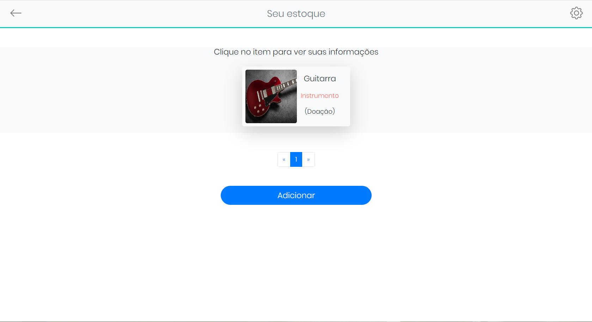
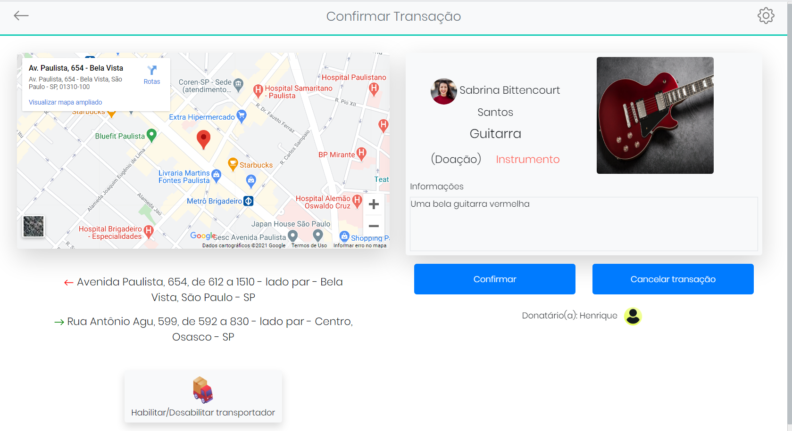

# Warehouse

Warehouse é um projeto que tem como objetivo conectar as pessoas que querem trocar ou doar objetos, incentivando os usuários a se livrarem do que não usam. 
Através da comunicação, facilitamos a reutilização e reciclagem dos itens, colaborando não só com o ambiente, mas também agregando valores para as pessoas.

## Funcionalidades

### Estoque

Ao entrar no site você poderá criar sua conta e ter seu primeiro contato com o Warehouse. Inicialmente seu estoque começerá vazio, mas você pode adicionar itens
os quais deseja doar ou trocar com outra pessoa. As informações necessárias serão: o nome do item, sua classificação, uma imagem dele, informações sobre o item e
se ele está disponível para doação ou troca. Ao adicionar um item ele ficará disponível publicamente no site

### Transação

As transações no site possuem 3 fases:

- **Contato:** Com seu item publicado, alguém interessado poderá entrar em contato com você iniciando uma transação entre ambos. Você terá a opção de aceitar ou recusar a 
transação. Caso seja uma troca, a pessoa que iniciar o contato deverá colocar um de seus itens do estoque como oferta na troca. Caso seja uma doação, a pessoa
que irá receber o item vai gastar um ticket da conta.

- **Confirmação:** Após a pessoa contatada aceitar iniciar a transação ambas poderão agora cancelar ou confirmar a transação. O intuito desta fase é fazer com que a pessoas entrem em
contato entre si para finalizar a negociação e confirmarem a transação de fato. Elas também têm a possibilidade de chamar ou não um transportador para o serviço.

- **Conclusão:** Nesta fase a transação não pode mais ser cancelada, ocorre o último contato entre as pessoas e quando ambos concluem ela se encerra. Caso for uma doação,
a pessoa que doou o item receberá um ticket e quem recebeu gastará um ticket. Se na transação houve um transportador ele receberá um ticket como recompensa.

### Transportador

O usuário tem a opção também de se voluntariar como transportador de uma transação, basta acessar as configurações de sua conta e habilitar o modo transportador.
A pessoa precisará cadastrar o modelo, placa e cor do carro e deverá indicar quando estará disponível para realizar transportes ao longo do mês.

### Tickets

Os tickets são um recurso do site que incentiva os usuários a contribuirem com doações ou realizando o transporte das transações. Quando
uma pessoa doa ou atua como transportadora  com êxito em uma transação, ela recebe um ticket de recompensa e poderá receber um item de doação usando o ticket. 
Usuários que acabaram de se cadastrar começam com 3 tickets para o uso.

## Screenshots

### Página inicial ([home.php](home.php))



### Sobre o site ([artigos.php](artigos.php))



### Perfil pessoal ([perfil.php](perfil.php))



### Estoque ([estoque.php](estoque.php))



### Transação ([transacao.php](transacao.php))



## Como usar o site no Windows 

O site foi desenvolvido usando o WampServer e não foi hospedado em nenhum domínio (é apenas um projeto de teste).

### Criando o servidor

- Baixe e instale a versão 3.2.0 do [WampServer](https://www.wampserver.com)
- Importe os arquivos deste repositório no diretório ```C:/wamp/www``` ou ```C:/wamp64/www```

### Criando o banco de dados e acessando o site

- Acesse em seu navegador ```http://localhost/phpmyadmin```
- Configure seu usuário e senha no arquivo [```Conexao_BD.php```](Conexao_BD.php)
- Crie uma base de dados com o nome ```warehouse_data```
- Importe o arquivo [```warehouse_data.sql```](warehouse_data.sql) na base de dados
- Acesse ```http://localhost/Warehouse/home.php```

## Tecnologias utilizadas

- **HTML5**
- **CSS3**
- **JavaScript ES6**
- **PHP7**
- **Bootstrap**
- **jQuery**

- UI desenvolvida no **Figma**

- Banco de dados utilizado - **MySQL**

## Desenvolvedores

### Gabriel Macedo Serafim
- **Contribuição:** HTML / CSS / Bootstrap / UI (Front-end)
- **GitHub:** [https://github.com/Djmax513](https://github.com/Djmax513)
- **LinkedIn:** [https://www.linkedin.com/in/gabriel-macedo-serafim2324/](https://www.linkedin.com/in/gabriel-macedo-serafim2324/)

### Guilherme Vichiato
- **Contribuição:** HTML / CSS / Bootstrap (Front-end)
- **GitHub:** [https://github.com/Vichiat0](https://github.com/Vichiat0)

### Gustavo Faganello Guimarães
- **Contribuição:** PHP (Back-end e Documentação)

### Henrique Barbosa
- **Contribuição:** JavaScript / jQuery / PHP (Back-end)
- **GitHub:** [https://github.com/HenriBDev](https://github.com/HenriBDev)
- **LinkedIn:** [https://www.linkedin.com/in/henribdev/](https://www.linkedin.com/in/henribdev/)
